# Flydigi Space Station + VADER 5 Pro — hướng dẫn đầy đủ bằng tiếng Việt

> Bản này ưu tiên người Việt mới dùng: giữ tên tiếng Anh đúng như UI để bạn tìm được nút, nhưng luôn giải thích bằng hành vi thực tế.

## Trạng thái của bộ tài liệu

- Controller kiểm tra: **VADER 5 Pro**.
- Firmware hiển thị khi chụp: **7.2.2.1**.
- Space Station hiển thị ở Device Home: **V5.0.1.1**.
- Ngày rà soát UI: **21/09/2026**.
- Ảnh trong guide là ảnh chụp trực tiếp từ UI thật, không phải mockup.

### Ký hiệu

- **✅ Đã xác minh**: có trên UI thật của Vader 5 Pro đang kiểm tra.
- **🧪 Code-only / chưa expose**: có dấu vết trong code hoặc chuỗi giao diện nhưng chưa thấy trên UI thật.
- **⚠️ Phụ thuộc điều kiện**: có thể tùy firmware, Engine, mode kết nối hoặc model.

Nếu gặp thuật ngữ khó hiểu, mở [Từ điển thuật ngữ](glossary.md).

---

## 1. Device Home — bắt đầu từ đâu?

**Đường đi:** mở Flydigi Space Station → chọn **VADER 5 Pro** → **Open device settings**.

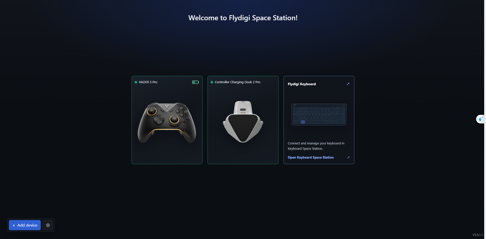

Ở đây bạn kiểm tra được:
- controller có được nhận hay không;
- pin/trạng thái kết nối;
- nút mở phần cấu hình thiết bị;
- phiên bản Space Station ở cuối giao diện.

Nếu chưa thấy VADER 5 Pro:
1. kiểm tra cáp/dongle;
2. thử bấm một nút trên controller;
3. reload Space Station;
4. chỉ khi device đã hiện mới tiếp tục cấu hình.

---

## 2. Bản đồ màn hình cấu hình chính

Sau khi mở VADER 5 Pro, màn hình chính có ba vùng lớn:

1. **trên cùng**: Basic / Advanced và Main Layer;
2. **giữa**: các tab Button Mapping, Stick, Trigger, Motion Control, Vibration, Lighting, Manage Macros;
3. **bên trái**: Manage, Profile 1–4 và Settings.

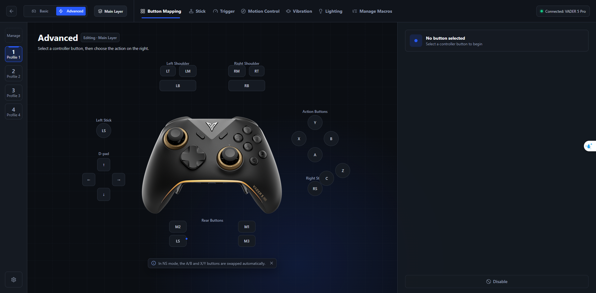

Đây là ảnh quan trọng nhất để định vị mọi phần còn lại.
## 3. Profile: Local và On-board khác nhau thế nào?

### On-board Profile

On-board = profile thực sự nằm trong controller.

Vader 5 Pro hiện hiển thị 4 slot:
- Profile 1;
- Profile 2;
- Profile 3;
- Profile 4.

Khi đổi on-board profile, mapping của tay cầm đổi theo slot đó.

### Local Profile Library

Bấm **Manage** để mở thư viện profile local.

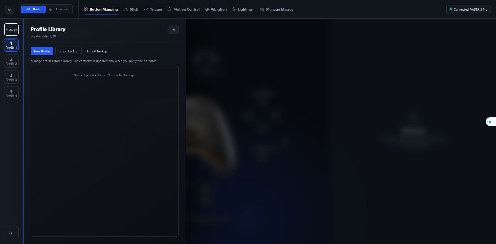

UI hiện xác nhận:
- **Local Profiles 0/20**;
- New Profile;
- Export backup;
- Import backup;
- controller chỉ được cập nhật khi profile được Apply xuống on-board.

Điểm dễ nhầm nhất:

> **Lưu/chỉnh profile local không có nghĩa controller đã nhận thay đổi.**

Quy trình an toàn:
1. chỉnh local profile;
2. kiểm tra lại;
3. backup nếu cần;
4. Apply vào đúng on-board slot;
5. test lại controller.

---

## 4. Basic và Advanced — nên chọn cái nào?

### Basic

Dùng khi:
- chỉ cần preset;
- mapping đơn giản;
- không cần nhiều layer/macro/zone;
- muốn cấu hình dễ hiểu.

### Advanced

Dùng khi:
- muốn nhiều kiểu kích hoạt trên một nút;
- dùng Shift Layer;
- dùng macro;
- chỉnh curve/zone;
- muốn tái tạo profile reWASD phức tạp.

Với bộ guide này, **Advanced** là chế độ chính.

---

## 5. Layer — “một nút có thể thành bộ nút khác”

**Đường đi:** phía trên màn hình → bấm **Main Layer**.

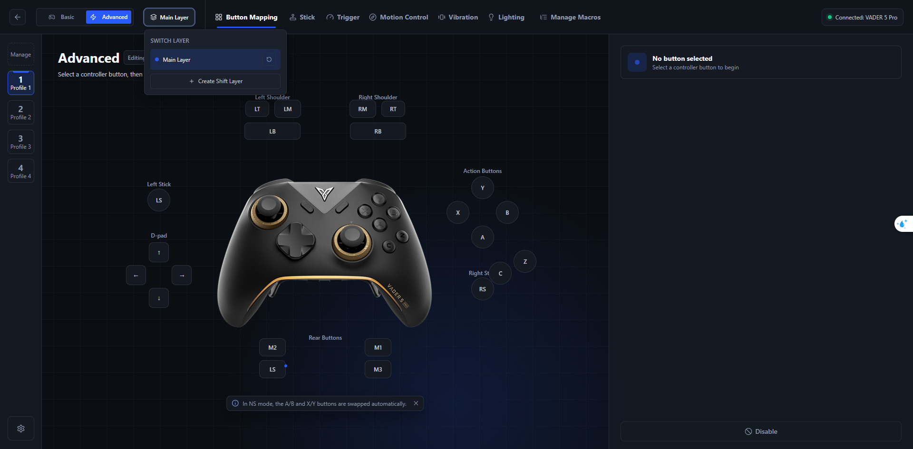

Vader 5 Pro hiện cho:
- Main Layer;
- tối đa 3 Shift Layer.

Hiểu đơn giản:
- Main Layer = trạng thái bình thường;
- Shift Layer = một bộ mapping phụ.

Ví dụ:
- bình thường A = A;
- giữ M2 để vào Shift Layer 1;
- lúc đó A = D-pad Down;
- thả M2 → A trở lại A.

### Hold và Toggle trong Layer

**Hold**:
- giữ nút → vào layer;
- thả → quay về.

**Toggle**:
- bấm lần 1 → vào layer;
- bấm lần 2 → quay về.

Nếu chỉ muốn “nút modifier”, ưu tiên Hold.
## 6. Button Mapping — phần quan trọng nhất

**Đường đi:** tab **Button Mapping** → chọn nút trên hình controller.

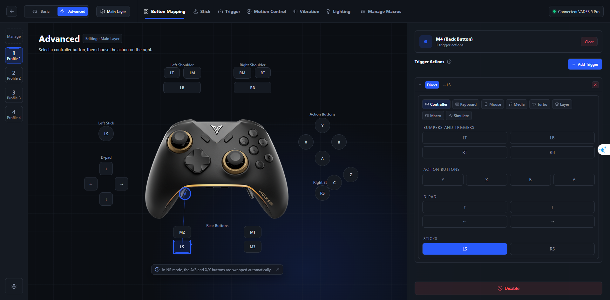

Trong ảnh, M4 đang có mapping kiểu Direct → LS.

### Source và Target

- **Source** = nút vật lý bạn đang bấm, ví dụ M4.
- **Target** = thứ game/Windows sẽ nhận, ví dụ LS.

Space Station expose nhiều loại target như:
- Controller;
- Keyboard;
- Mouse;
- Media;
- Turbo;
- Layer;
- Macro;
- Simulate;
- Disable.

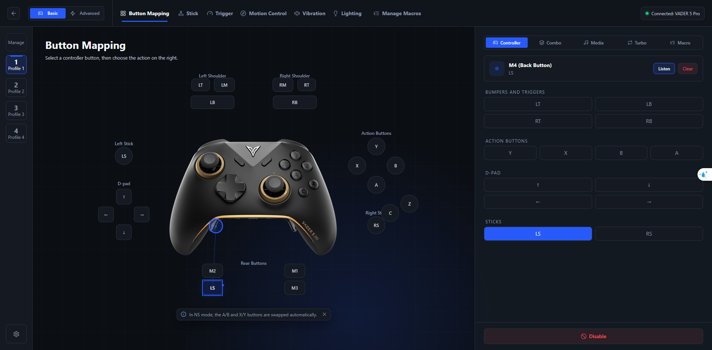

### Các kiểu kích hoạt

Bấm **Add Trigger** để thấy các kiểu activator.

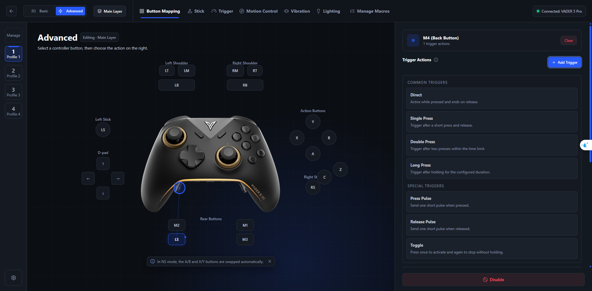

#### Direct

Giữ source bao lâu → giữ target bấy lâu.

Ví dụ M4 → LS:
- giữ M4 = LS đang bị nhấn;
- thả M4 = LS nhả.

#### Single Press

Chỉ chạy sau một cú bấm ngắn và nhả.

Có thể hơi trễ hơn Direct vì hệ thống còn phải phân biệt Double Press.

#### Double Press

Bấm hai lần đủ nhanh mới chạy.

#### Long Press

Phải giữ đủ lâu mới chạy.

#### Press Pulse — đừng hiểu đơn giản là “xung”

Ý nghĩa thực tế:

> vừa ấn source xuống → target được bấm + nhả rất nhanh đúng một lần.

Giữ source lâu hơn không làm target bị giữ.

#### Release Pulse

Target chỉ được bấm + nhả rất nhanh **lúc bạn thả source**.

#### Toggle

Bấm lần 1 để bật trạng thái, lần 2 để tắt.

Xem giải thích sâu hơn tại [Từ điển thuật ngữ](glossary.md).
### Khi nào dùng loại nào?

| Mục tiêu | Kiểu phù hợp |
|---|---|
| Đổi M4 thành LS bình thường | Direct |
| Giữ M2 để vào Shift Layer | Direct/Hold |
| Bấm M3 bật gyro, lần sau tắt | Toggle |
| Bấm nhanh một lần để gửi phím | Single Press hoặc Press Pulse |
| Chỉ chạy khi thả nút | Release Pulse |
| Một nút có action phụ khi giữ lâu | Long Press |

### Disable

Disable làm source không còn phát native action ở mapping đó.

Dùng cẩn thận vì có thể khiến nút “biến mất” nếu bạn quên đã disable.

### Simulate

Simulate dùng để tạo đầu ra không chỉ là button:
- độ lệch stick;
- trigger analog;
- mouse movement;
- mouse wheel;
- vibration.

---

## 7. Stick — chỉnh cảm giác analog

**Đường đi:** tab **Stick**.

### Stick Basic

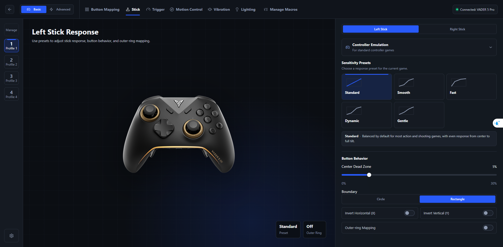

Các thành phần quan trọng:
- preset response;
- Center Dead Zone;
- Boundary;
- Invert X/Y;
- Outer-ring Mapping;
- tùy mode có Controller Emulation hoặc Keyboard WASD.

### Center Dead Zone

Hiểu là:
> vùng nhỏ quanh tâm stick được coi như bằng 0.

Tăng khi:
- stick drift;
- tâm rung.

Không tăng quá cao vì sẽ làm mất micro-movement.

### Boundary

**Circle**:
- biên tròn;
- tự nhiên hơn.

**Rectangle**:
- dễ đạt output lớn ở góc chéo.

### Preset

- Standard: cân bằng;
- Smooth: mềm vùng đầu;
- Fast: phản hồi sớm;
- Dynamic: vùng đầu chính xác, vùng sau nhanh;
- Gentle: dịu hơn gần biên.

Tên preset chỉ là điểm bắt đầu. Hãy test trong game.

### Outer-ring Mapping

Khi stick đi tới vùng ngoài cùng, có thể phát thêm action.

Ví dụ:
- đẩy LS > 90% → Sprint.
## 8. Stick Advanced — Curve và Zone

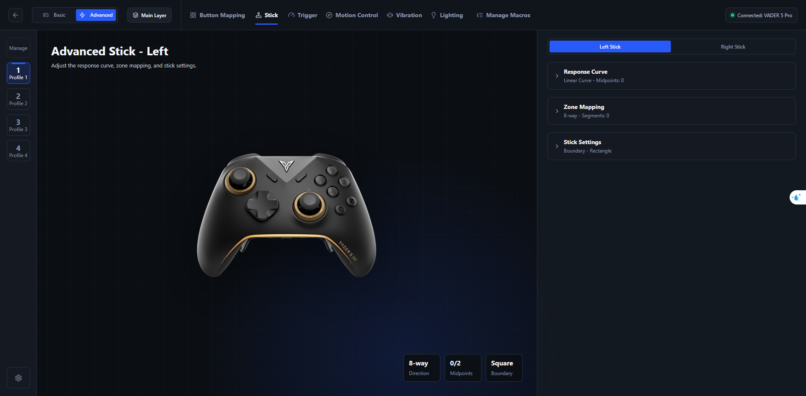

### Response Curve

Curve quyết định:
- input bao nhiêu;
- output bao nhiêu.

Không phải chỉ là “sensitivity”.

Ví dụ:
- đầu curve nhẹ → aim nhỏ mịn hơn;
- cuối curve dốc → full turn vẫn nhanh.

UI hiện cho tối đa 2 midpoint.

### Zone Mapping

Bạn có thể chia stick theo:
- hướng;
- bán kính;
- segment.

Direction Mode:
- 8-way;
- 4-way;
- 4-way Overlap.

Ví dụ thực tế:
- 0–70% = đi;
- >80% = Sprint;
- hướng chéo = action riêng.

---

## 9. Trigger Basic — cò LT/RT

**Đường đi:** tab **Trigger** → Basic.

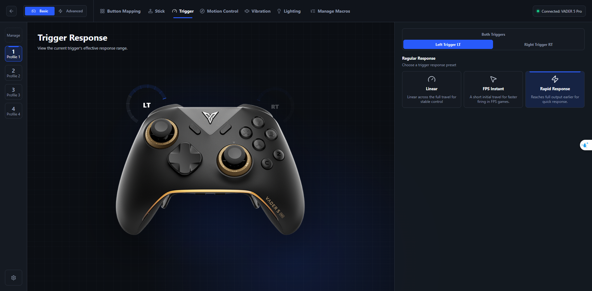

UI thật hiện có các kiểu regular response như:
- Linear;
- FPS Instant;
- Rapid Response.

### Linear

Bóp từ ít tới nhiều → output tăng đều.

Đây là preset baseline tốt nhất để bắt đầu.

### FPS Instant

Giảm hành trình cần thiết trước khi cò phản hồi mạnh.

Dùng cho shooter khi ưu tiên bắn nhanh hơn kiểm soát analog.

### Rapid Response

Đạt output cao sớm hơn Linear nhưng vẫn giữ cảm giác có dải bóp.

---

## 10. Trigger Advanced — curve và 3 vùng bóp

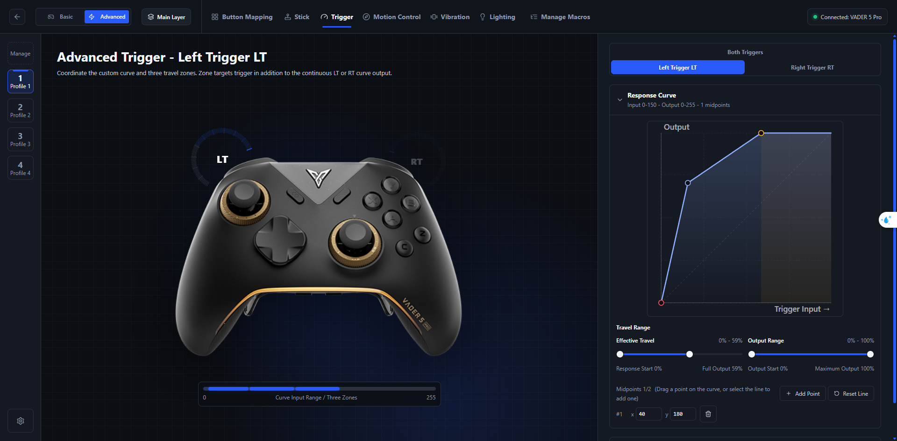

UI Advanced hiện cho:
- Effective Travel;
- Output Range;
- Response Curve;
- tối đa 2 midpoint;
- 3 Travel Zones.

### Effective Travel

Đây là phần hành trình vật lý thực sự được dùng.

Ví dụ đặt 0–60%:
- không cần bóp tới hết cò vật lý;
- vùng 0–60% được dùng làm dải input chính.

### Output Range

Bạn có thể scale dải input vật lý thành dải output khác.

### Travel Zones

Ba vùng:
- Light Press;
- Medium Press;
- Heavy Press.

Mỗi vùng có thể phát action phụ, trong khi LT/RT analog vẫn tiếp tục output.
## 11. Trigger Haptics — vì sao bạn không thấy menu?

Đây là chỗ bản guide cũ gây hiểu nhầm.

### Kết quả kiểm tra UI thật

**🧪 Trên VADER 5 Pro đang kiểm tra, tab Trigger không hiện:**
- Trigger Mode;
- Pistol;
- Rifle;
- Shotgun;
- Sniper;
- Sword;
- Trigger Travel / Frequency / Force theo kiểu haptic scene.

Tuy nhiên trong code/chuỗi giao diện Space Station có các tên trên.

Kết luận đúng hơn:

> Trigger Haptics là capability tồn tại trong code của Space Station nhưng **không được UI Vader 5 Pro hiện tại expose như một menu sử dụng được**.

Do đó nếu bạn tìm mãi không thấy:
- không phải bạn tìm sai;
- không nên cố làm theo phần này như một bước bắt buộc.

### Đừng nhầm với Trigger-Bound Grip Feedback

Trigger-Bound Grip Feedback nằm ở **Vibration** và là rung grip liên quan tới LT/RT.

Nó **không phải** lực cản/cảm giác cơ học ở trigger.

---

## 12. Motion Control / Gyro

**Đường đi:** tab **Motion Control**.

### Basic

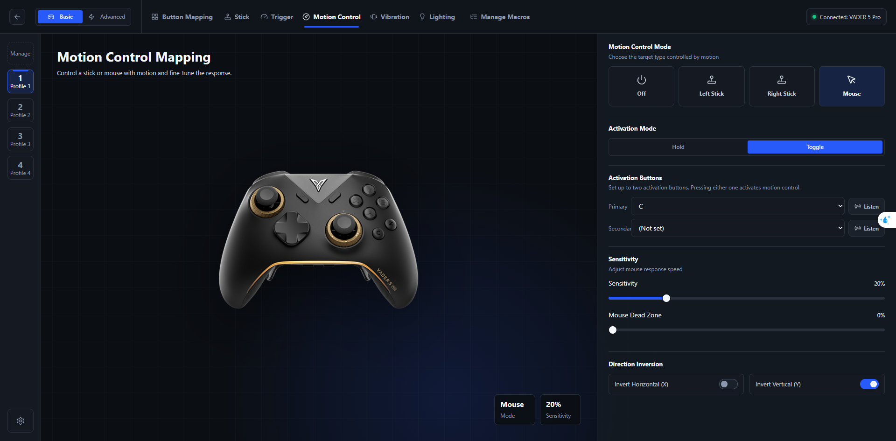

Mode có thể gồm:
- Off;
- Left Stick;
- Right Stick;
- Mouse.

Activation:
- Hold;
- Toggle.

Có thể có Primary và Secondary activation button.

### Mouse gyro

Các thông số chính:
- Sensitivity;
- Mouse Dead Zone;
- Invert X;
- Invert Y.

Best.rewasd của profile Elden Ring đang cần:
- Mouse;
- Toggle;
- M3 làm activation;
- Invert Y ON;
- Invert X OFF.

Không copy sensitivity 1:1 từ reWASD sang Space Station.
### Motion Advanced

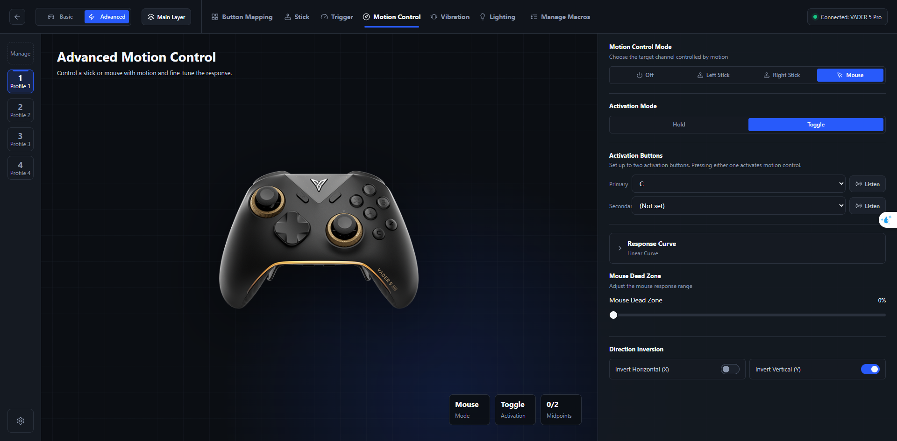

Advanced thêm Response Curve.

Quy trình tune gyro nên làm:
1. để curve Linear;
2. Dead Zone 0%;
3. đặt controller yên và xem có drift không;
4. nếu drift, tăng 1% rồi 2%;
5. chỉnh Sensitivity trước;
6. chỉ chỉnh curve sau khi tốc độ cơ bản đã hợp.

Nếu fine aim tốt nhưng quay nhanh quá chậm:
- tăng gain ở vùng cuối curve.

Nếu quay nhanh ổn nhưng micro-aim giật:
- giảm gain ở vùng đầu.

---

## 13. Vibration — rung tay cầm

**Đường đi:** tab **Vibration**.

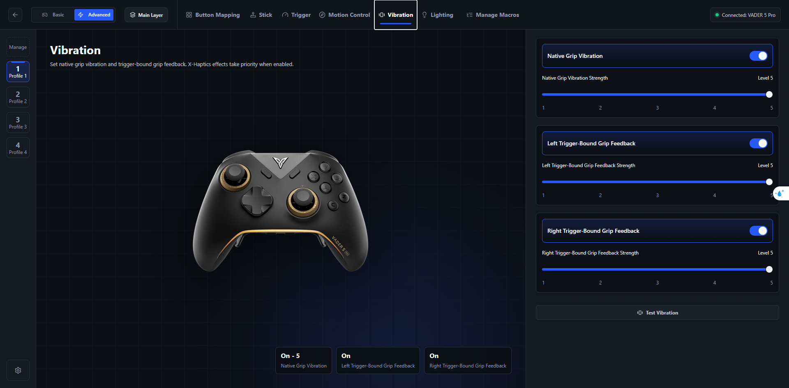

UI hiện có:
- Native Grip Vibration;
- Left Trigger-Bound Grip Feedback;
- Right Trigger-Bound Grip Feedback;
- Strength;
- Test Vibration.

### Native Grip Vibration

Rung bình thường ở phần tay nắm.

### Trigger-Bound Grip Feedback

Bóp LT/RT → phần grip có rung phản hồi liên quan.

Tên dễ gây hiểu nhầm, nhưng:
- đây không phải adaptive trigger;
- không tự tạo lực cản ở cò.

### X-Haptics priority

UI có câu nhắc rằng khi X-Haptics được bật, effect của X-Haptics có thể ưu tiên hơn setting rung gốc.

---

## 14. Lighting — đèn RGB

**Đường đi:** tab **Lighting**.

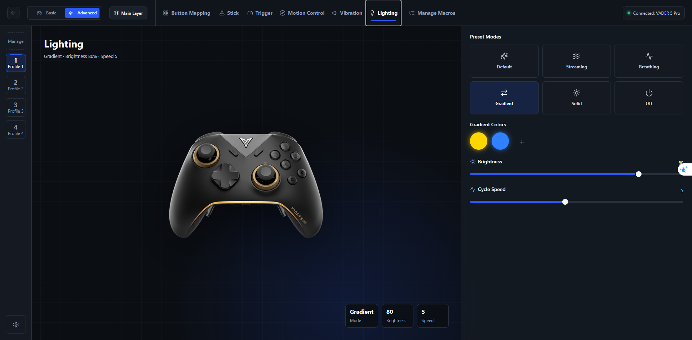

Các mode được UI expose:
- Default;
- Streaming;
- Breathing;
- Gradient;
- Solid;
- Off.

Tùy mode có:
- màu;
- saturation;
- brightness;
- cycle speed.

Lighting chỉ ảnh hưởng hiển thị/đèn, không ảnh hưởng mapping.
## 15. Macro — nhiều thao tác trong một nút

**Đường đi:** **Manage Macros**.

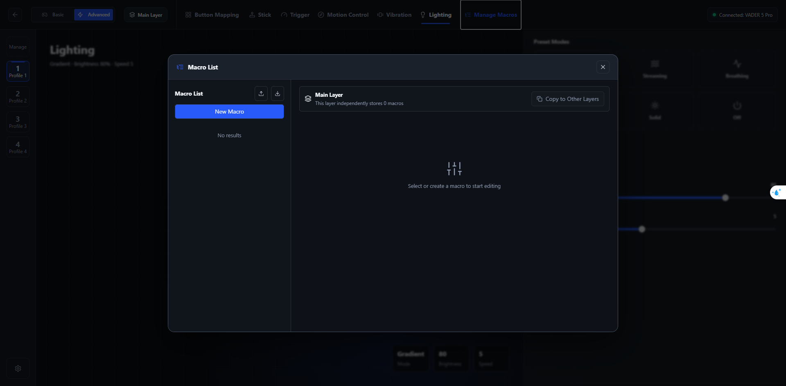

Macro được quản lý theo layer.

UI/code hiện giới hạn:
- tối đa 10 macro mỗi layer;
- timeline tối đa 65,535 ms.

### Macro Editor

Bạn có thể:
- thêm action;
- record;
- chỉnh delay;
- chọn Trigger Mode.

Action phổ biến:
- Press;
- Release;
- Push;
- Center.

### Trigger Mode

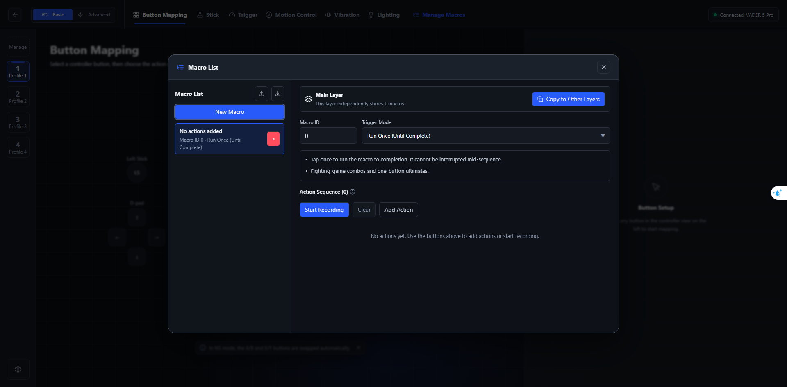

Các mode được Space Station expose:
- Key Combination (Hold);
- Run Once (Until Complete);
- Loop (Stop on Release);
- Loop (Finish Current Cycle).

Hiểu nhanh:
- Key Combination = giữ nhiều target cùng lúc;
- Run Once = chạy một lần hết sequence;
- Loop Stop = thả là cắt ngay;
- Loop Finish = thả nhưng chạy hết vòng đang dở.

Đọc giải thích chi tiết tại [Từ điển thuật ngữ](glossary.md).

---

## 16. Settings — thiết lập toàn controller

**Đường đi:** cột trái → **Settings**.

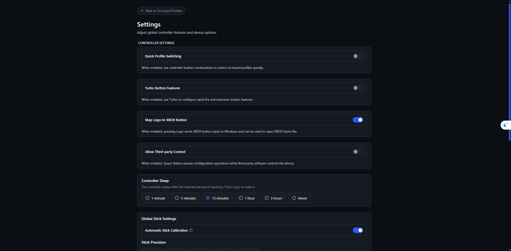

### Quick Profile Switching

Cho phép dùng tổ hợp trên controller để chuyển nhanh Profile 1–4.

UI mô tả FN + A/B/X/Y tương ứng các slot.

### Turbo Button Features

Cho phép dùng Turbo để cấu hình rapid fire và một số chức năng extension button.

### Map Logo to XBOX Button

Khi bật:
- nút Logo gửi XBOX button input cho Windows;
- có thể dùng với Xbox Game Bar.

### Allow Third-party Control

Khi app khác takeover controller:
- Space Station có thể pause thao tác cấu hình để tránh conflict.

Nếu dùng reWASD, đây là setting quan trọng.

### Controller Sleep

Chọn thời gian không hoạt động trước khi controller sleep.
### Automatic Stick Calibration

Giúp controller tự hiệu chuẩn stick.

Nếu drift:
1. calibration trước;
2. test tâm;
3. chỉ tăng Dead Zone khi cần.

### Stick Precision

Các mức 8/9/10/11/12-bit là độ phân giải dữ liệu.

Đừng mặc định chọn cao nhất sẽ luôn tốt nhất:
- bit cao hơn có thể phản ánh cả nhiễu nhỏ;
- game có thể không tận dụng hết.

### Factory Reset

Factory Reset có thể xóa:
- device settings;
- calibration;
- pairing information.

Chỉ dùng khi thực sự cần và đã backup.

---

## 17. Firmware

Trong Settings, UI hiện:
- VADER 5 Pro;
- Firmware 7.2.2.1;
- Component Firmware Versions;
- Firmware Update.

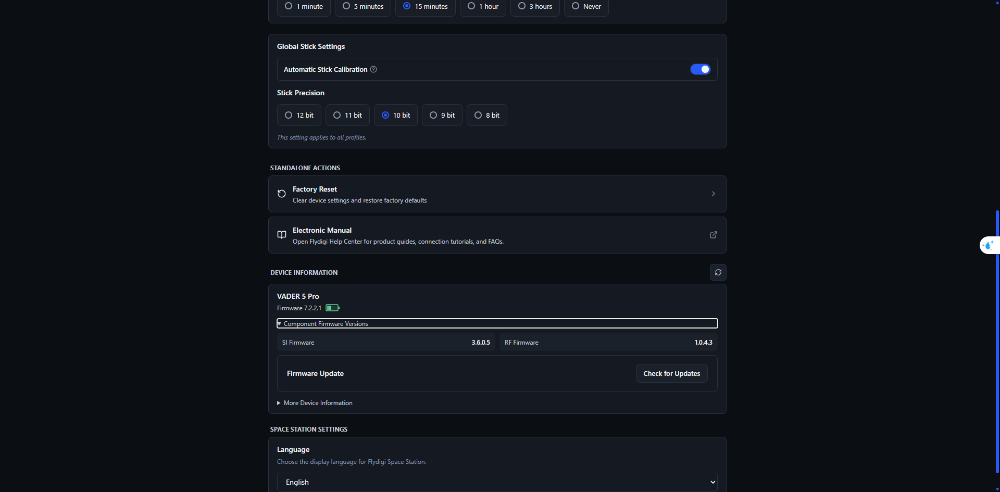

Khi expand Component Firmware Versions, UI hiện các component như:
- SI Firmware;
- RF Firmware;
- và component khác tùy thiết bị.

Không update firmware giữa lúc:
- pin yếu;
- kết nối chập chờn;
- controller đang bị app khác takeover.

---

## 18. X-Haptics — trạng thái xác minh

Trong code Space Station có các chuỗi:
- Real-time Audio Haptics;
- Adaptive Trigger;
- UDP/Telemetry Haptics;
- X-Haptics Engine.

**🧪 Nhưng màn hình cấu hình chính của Vader 5 Pro đã chụp không có tab X-Haptics riêng.**

Vì vậy guide này:
- không coi X-Haptics là bước bắt buộc;
- không bảo bạn tìm một menu không xuất hiện;
- chỉ ghi nhận nó là capability phụ thuộc Engine/model/firmware.

---

## 19. Quy trình cấu hình an toàn từ đầu

1. Mở Device Home, xác nhận đúng VADER 5 Pro.
2. Chọn đúng on-board profile.
3. Backup trước khi thay đổi lớn.
4. Chọn Advanced nếu dùng layer/macro.
5. Làm Button Mapping trước.
6. Test Main Layer.
7. Tạo Shift Layer.
8. Test layer.
9. Chỉnh Stick Dead Zone.
10. Chỉnh Stick Curve.
11. Chỉnh Trigger.
12. Chỉnh Gyro.
13. Tạo Macro sau cùng.
14. Chỉnh Vibration/Lighting.
15. Apply xuống controller.
16. Test joy.cpl.
17. Sau đó mới mở game.
## 20. Thứ tự debug khi có lỗi

Nếu một nút sai:
1. xem đang ở layer nào;
2. xem source nào;
3. xem activator gì;
4. xem target gì;
5. nếu target là Macro, mở macro;
6. test joy.cpl;
7. tắt reWASD;
8. tắt Steam Input tạm thời;
9. test lại.

Nếu gyro sai:
1. kiểm tra mode;
2. activation Hold/Toggle;
3. Invert X/Y;
4. Dead Zone;
5. Sensitivity;
6. Curve.

Nếu game bị bấm hai lần:
- nghi ngờ double input trước khi nghi controller hỏng.

---

## 21. Bảng “có thật trên UI hay không?”

| Tính năng | Trạng thái |
|---|---|
| 4 on-board profile | ✅ Đã thấy |
| Main + Shift Layer | ✅ Đã thấy |
| Direct / Single / Double / Long / Pulse / Toggle | ✅ Đã thấy |
| Controller / Keyboard / Mouse / Media / Turbo / Macro... | ✅ Có capability trong UI |
| Stick Basic + Advanced | ✅ Đã thấy |
| Stick Curve / Zone | ✅ Đã thấy |
| Trigger Linear / FPS Instant / Rapid Response | ✅ Đã thấy |
| Trigger Curve + 3 Travel Zones | ✅ Đã thấy |
| Gyro Mouse / Stick | ✅ Đã thấy |
| Vibration / Trigger-Bound Grip Feedback | ✅ Đã thấy |
| Lighting | ✅ Đã thấy |
| Macro editor | ✅ Đã thấy |
| Settings / calibration / precision / firmware | ✅ Đã thấy |
| Trigger Haptics scene Pistol/Rifle/... | 🧪 Có trong code, chưa thấy trên UI Vader 5 Pro hiện tại |
| X-Haptics tab | 🧪 Có trong code/Engine layer, chưa thấy trong UI cấu hình chính hiện tại |

---

## 22. Nên đọc tiếp gì?

- [Từ điển thuật ngữ](glossary.md): giải thích từ khó theo hành vi thực tế.
- [Flydigi vs reWASD](comparison.md): cái nào nên làm ở đâu.
- [Migrate Best.rewasd](migration.md): tái tạo profile Elden Ring.
- [Troubleshooting](troubleshooting.md): xử lý lỗi từng bước.
